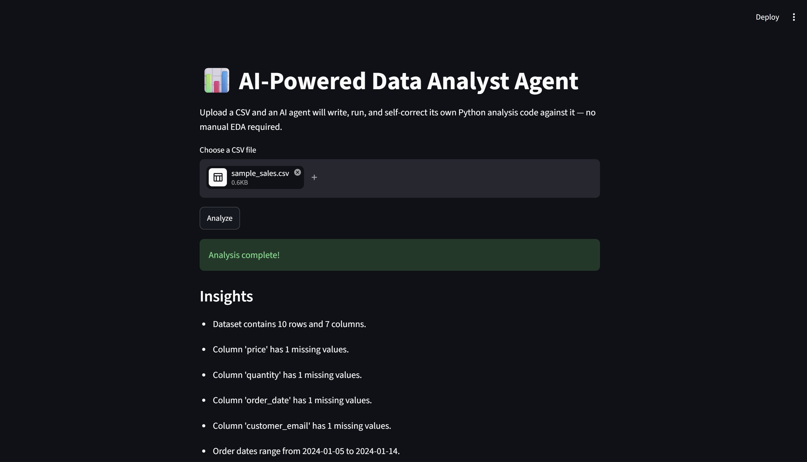
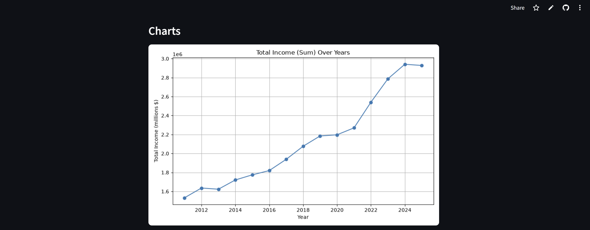
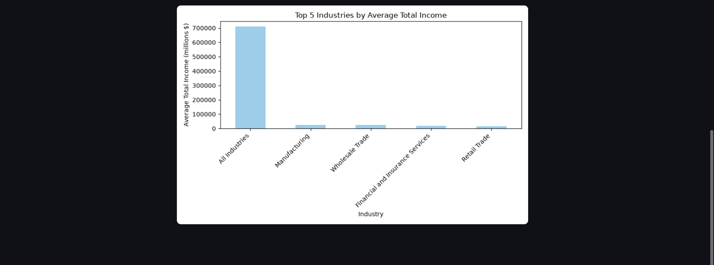

# AI-Powered Data Analyst Agent

An agent that takes an uploaded CSV, autonomously writes and executes its own
Python analysis code using an LLM, generates insights and charts, and
self-corrects if the generated code errors out on malformed data.

Built as a portfolio project, phase by phase, with a focus on understanding
every piece rather than scaffolding it all at once.

**🔗 Live demo:** https://ai-data-analyst-agent-j2hnysterzf5yhjhathkqe.streamlit.app/
*(Free-tier hosting — if the app shows a "wake up" screen, it just went to sleep from inactivity; one click and it's back in ~15 seconds.)*

## Screenshots





## Results

In a timed personal test, this agent completed first-pass exploratory data
analysis on a 200-row dataset in **6.5 seconds**, versus **3.7 minutes**
doing the same fixed checklist of analysis by hand — a **97% reduction** in
my own analysis time on that dataset (single trial, full methodology and
honest caveats in `tests/benchmark_results.md` and the Phase 9 log below).

## Why this project

Most "AI data analyst" demos just wrap an LLM around `df.describe()`. This one
is agentic in the real sense: the LLM writes actual Python analysis code for
*this specific dataset*, that code is executed in a controlled loop, and if it
fails (bad dtypes, missing values, malformed input) the error is fed back to
the LLM so it can fix its own code and retry — without a human in the loop.

## Architecture (evolving as we build)

```
app/
├── ingestion/   # Load + profile any uploaded CSV (dtypes, nulls, shape)
├── agent/       # Groq LLM client + the "data analyst" system prompt
├── executor/    # Sandboxed execution of LLM-generated code + self-correction
└── output/      # Structuring insights and saving charts
```

The `agent/` (decides *what* code to run) and `executor/` (actually *runs* it)
are kept as separate modules on purpose — that boundary is the core safety
design of this system, and it's set up from day one even though the executor
itself isn't built until Phase 4.

## Build log

### Phase 1 — Project setup ✅
- Folder structure created (see above), split by responsibility so each
  folder maps to a later build phase.
- `requirements.txt` started minimal (`pandas` only) — it will grow honestly
  as each phase needs a new dependency, not pre-filled up front.
- `.gitignore` set up to exclude the virtual environment, `.env` secrets,
  Python cache files, and generated chart outputs.
- `.env.example` documents the one environment variable the project needs
  (`GROQ_API_KEY`) without exposing any real secret.
- Git repo initialized and pushed to GitHub.

### Phase 2 — Core CSV ingestion ✅
- `app/ingestion/csv_profiler.py` added: `load_csv()` safely reads a CSV
  (clear errors on missing/empty/malformed files), and `profile_dataframe()`
  turns a DataFrame into a compact profile dict — shape, per-column dtype,
  null counts, unique counts, duplicate row count, and a few sample rows.
- Deliberately built by hand instead of using an auto-EDA library
  (e.g. `ydata-profiling`) — this profiling logic is what the LLM will
  reason over in Phase 3, so we need full control over its shape and content.
- Profile is a plain `dict` rather than a custom class, since it needs to
  convert cleanly to JSON/text for the LLM prompt in the next phase.
- Added `data/samples/sample_sales.csv`, a small sample dataset (10 rows,
  a few intentional missing values) used to manually verify the profiler.

### Phase 3 — LLM connection ✅
- `app/agent/llm_client.py` added: connects to Groq's free API using the
  official `groq` Python client. *(Originally used `llama-3.3-70b-versatile`;
  switched to `openai/gpt-oss-120b` after Groq deprecated that model on
  2026-08-16 — a live example of a third-party API changing under a
  running project.)*
- Wrote a system prompt that constrains the LLM to a single role — given
  a dataset profile (from Phase 2), output *only* a fenced Python code
  block that analyzes a DataFrame already loaded as `df`. No chat, no
  explanation, no loading logic of its own.
- `generate_analysis_code(profile)` sends the profile as JSON in the
  user message and returns the extracted code as a plain string — it
  does **not** execute that code (that's Phase 4, kept in a separate
  `executor/` module on purpose).
- Code extraction uses a regex to pull text out of a ```` ```python ... ``` ````
  fence, with a naive fallback if the model doesn't follow instructions —
  full defensive handling of bad model output comes in Phase 6.
- API key is read from a local `.env` file via `python-dotenv`; `.env`
  itself is git-ignored and was never shared outside the developer's
  own machine.
- Added `groq` and `python-dotenv` to `requirements.txt`.

### Phase 4 — Code execution loop ✅ (the agentic core)
- `app/executor/code_executor.py` added: `run_code()` executes LLM-generated
  code in an isolated **subprocess** (not `exec()` in-process) — a crash
  only kills that subprocess, and a hang gets force-killed after a
  15-second timeout. Chosen over `exec()` for real crash/hang isolation,
  and over Docker for staying free and simple enough to build and explain
  at this stage (Docker-based sandboxing noted as a future improvement).
- `run_with_self_correction()` is the actual agent loop: generate code →
  run it → if it fails, send the exact error message back to the LLM,
  get corrected code, retry — up to 3 retries (4 attempts total) before
  honestly reporting failure. Every attempt (code, success/fail, output)
  is kept in a history list for transparency/debugging.
- `llm_client.py` extended: `generate_analysis_code()` now optionally
  accepts `previous_code` + `error_message` to build a "fix this" prompt
  instead of a fresh one — same API call, different message depending
  on whether this is a first attempt or a retry.
- Verified locally with hand-written test cases before relying on live
  LLM output: a successful run, a deliberate `NameError`, and a deliberate
  infinite loop — confirming success capture, error capture, and the
  timeout kill-switch all work correctly.

### Phase 5 — Insight & chart generation ✅
- System prompt extended: the LLM may now also use `matplotlib.pyplot`
  (as `plt`), save 1-3 charts as `outputs/chart_1.png`, `chart_2.png`, etc.,
  and must prefix every genuine finding with an `INSIGHT: ` marker so it
  can be reliably separated from any other printed text.
- `app/output/insights.py` added: `parse_insights()` filters stdout for
  `INSIGHT: ` lines, `list_chart_files()` finds saved chart images,
  `clear_outputs_dir()` wipes old charts before each run so only the
  current run's images are ever present, and `analyze_and_structure()`
  ties Phases 2-5 into one call returning a clean result dict.
- `code_executor.py`'s subprocess wrapper now forces matplotlib into
  non-interactive `Agg` (file-only) mode before any generated code runs —
  a defensive measure so a stray `plt.show()` call can't hang the
  subprocess waiting on a GUI window that will never appear.
- Verified locally with hand-written fake "LLM output" before trusting
  live model output, which caught a real bug: the wrapper script wasn't
  actually importing `matplotlib.pyplot as plt` for the generated code to
  use, despite the system prompt promising it was available — fixed
  before it ever reached a real run.

### Phase 6 — Malformed-input hardening ✅
- `csv_profiler.py`: added a 5 MB file-size cap (checked before reading,
  so an oversized file is rejected instantly instead of loading first)
  and a UTF-8 → latin-1 encoding fallback for files exported from tools
  that don't use UTF-8.
- `insights.py`: added `analyze_csv_file(csv_path)`, a single hardened
  entry point wrapping the *entire* pipeline (ingestion → agent →
  executor → output) in layered error handling — specific messages for
  expected failures (bad/empty/oversized file), plus one broad backstop
  for anything unexpected. Nothing in this pipeline can crash with a raw
  traceback anymore; every path returns the same clean result shape.
  This is also the exact function Phase 7's API will call.
- Added deliberately messy sample CSVs and stress-tested against them:
  a header-only file and a truly empty file (both caught cleanly at
  ingestion, no LLM call wasted); a headerless file (pandas silently
  mistakes the first data row for headers — no crash, just wrong column
  names) and a mixed-type file (numeric columns containing stray text
  like `"N/A"`, `"twenty-five"`).
- **Real bug found and fixed during stress-testing:** on Windows, writing
  the LLM's generated code to a temp file (and running it as a
  subprocess) used the platform's default text encoding, not UTF-8.
  Windows' default can't represent some valid Unicode characters the
  model occasionally writes (e.g. a typographic dash), so it crashed
  with `'charmap' codec can't encode character...`. Fixed by explicitly
  pinning `encoding="utf-8"` for both the temp file and the subprocess
  (and `PYTHONIOENCODING=utf-8` for the child process's own stdout).
  This never appeared during development because this session's testing
  environment defaults to UTF-8 already — a real "works on my machine"
  bug, only caught because a real user tested on real Windows.
- **Self-correction proof, on real messy input, not just buggy code:**
  running the headerless CSV through the full pipeline failed on attempt
  1 and succeeded on attempt 2 — the model rewrote its own code to
  dynamically detect numeric/date/categorical columns instead of
  assuming fixed names, since the "column names" were nonsense left over
  from the missing header row. The mixed-type CSV succeeded on the
  *first* attempt, with the model proactively using
  `pd.to_numeric(errors="coerce")` on its own to handle the stray text.
- Known limitation (not fixed, intentionally): against the headerless
  file, the agent's date-detection logic misidentified a small integer
  ID column as a date (interpreting it as a Unix timestamp), producing a
  harmless but wrong "date range" insight. Left as-is and documented
  rather than specifically engineered around — a good example of an
  honest limitation for the final write-up (Phase 11).

### Phase 7 — Backend API ✅
- `main.py` added: a FastAPI app with two endpoints — `GET /` (health
  check) and `POST /analyze` (accepts an uploaded CSV, runs the full
  agent pipeline, returns JSON). Deliberately thin: it just saves the
  upload to a temp file and calls Phase 6's `analyze_csv_file()` —
  virtually no new logic, since the hardened pipeline already existed.
- Chart images are served as static files (`app.mount("/charts", ...)`)
  rather than base64-encoded into the JSON response — keeps the main
  response small and fast, and is the standard REST pattern for serving
  generated files. `/analyze`'s response converts local paths like
  `outputs/chart_1.png` into fetchable URLs like `/charts/chart_1.png`.
- Verified locally (server started, hit with `curl`, and a static image
  request confirmed a real PNG came back) before relying on manual
  browser testing.
- Free interactive API docs at `/docs` (built into FastAPI) used to
  test the full upload → analyze → JSON flow — confirmed working
  end-to-end with real chart images served back correctly.
- New dependencies: `fastapi`, `uvicorn` (the server that actually runs
  a FastAPI app), `python-multipart` (required specifically for file
  upload support).

### Phase 8 — Frontend ✅
- `streamlit_app.py` added: a Streamlit UI with a file uploader and an
  "Analyze" button that calls the Phase 7 FastAPI backend over real
  HTTP (`requests.post`) — a true frontend/backend split, not a
  same-process shortcut.
- The "Analyze" click is a deliberate trigger, with the result cached
  in `st.session_state` — necessary because Streamlit reruns the whole
  script on every interaction, so without a trigger + cache, an
  unrelated click could silently re-run the (slow, LLM-calling)
  analysis.
- `BACKEND_URL` reads from an environment variable with a localhost
  default, so the deployed frontend (Phase 10) can point at a deployed
  backend without a code change.
- A spinner shows during the (10-30 second) analysis call, satisfying
  the "show progress as agent thinks" requirement from the original
  plan — full live step-by-step progress (e.g. streaming which retry
  attempt is running) would need WebSockets/SSE on the backend, which
  is a reasonable future improvement but out of scope for now.
- Verified locally by running both servers together and confirming
  both boot and respond over HTTP before manual browser testing.
- Confirmed working end-to-end: real CSV upload → live LLM analysis →
  insights and both chart images rendering correctly on the page.

### Phase 9 — Testing ✅
- Added two new sample datasets in different domains (`employee_hr.csv`,
  `movie_ratings.csv`, 200 rows each) alongside the original sales data,
  to test that the agent generalizes rather than being tuned to one
  dataset shape.
- `tests/benchmark_agent.py` times the agent's actual elapsed time
  (profile → LLM → execute → self-correct if needed) on all three.
- Built an honest human-timing methodology, since I can't fabricate a
  manual-EDA baseline: `tests/manual_eda_checklist.md` (a fixed 8-step
  checklist matching the categories of analysis the agent produces, so
  the comparison is fair) and `tests/manual_eda_timer.py` (a wall-clock
  stopwatch measuring real elapsed time — including thinking and typing,
  not just code execution, since that's what "time saved" has to mean
  for a real human doing this for the first time).
- **Measured result (single dataset, single trial, `employee_hr.csv`):
  agent completed the analysis in 6.5s vs. 3.7 minutes (224s) doing the
  same checklist manually — a 97.1% reduction in personal analysis time
  on that dataset.** Full numbers and honest caveats about scope (one
  dataset, one trial, one person) are in `tests/benchmark_results.md` —
  written deliberately to avoid overclaiming this as a general/validated
  statistic.
- Rejected citing a generic published "time saved" statistic instead of
  measuring it: researched the commonly-cited "80% of a data scientist's
  time is spent cleaning data" claim and found it (a) measures something
  different — share of overall project time, not per-dataset EDA time —
  and (b) is itself a contested, frequently-disputed figure. Using it
  here would have meant borrowing a shaky number to describe something
  it wasn't measuring.

### Phase 10 — Deployment ✅
- **Live demo:** https://ai-data-analyst-agent-j2hnysterzf5yhjhathkqe.streamlit.app/
- **Original plan vs. what actually shipped:** the plan was two separate free
  services — Streamlit for the UI, FastAPI (Phase 7) as a separately hosted
  backend, talking over HTTP, exactly as built in Phases 7-8. Getting a
  genuinely free, no-credit-card, persistent host for the *backend* turned
  out to be the real obstacle, not the frontend:
  - **Hugging Face Spaces** looked free based on their published pricing
    page, but the actual Space-creation UI showed Docker/Gradio Spaces now
    require a paid plan — a live contradiction of that earlier research,
    caught by trying to actually create one.
  - **Render** was ambiguous on whether a free web service requires a card
    on file, based on their docs alone.
  - **Vercel** is confirmed free for FastAPI, but Vercel Functions are
    stateless/serverless — a genuine architecture mismatch, not just a cost
    question: our design had one request save a chart file and a second
    request fetch it via a static file mount, and those two requests could
    land on different, disk-isolated containers with nothing shared between
    them.
- **The pivot:** rather than keep hunting for host #3, `streamlit_app.py`
  was rewritten to call `app.output.insights.analyze_csv_file()` directly,
  in-process, instead of making an HTTP request to a separately-hosted
  FastAPI backend. One Streamlit process, one filesystem, one free host
  (Streamlit Community Cloud) — the chart-sharing problem disappears
  because there's no longer a second service to share anything with.
  `BACKEND_URL`/`requests` are gone from the frontend; chart paths returned
  by `analyze_csv_file()` are passed straight to `st.image()`.
  The tradeoff: the frontend now imports directly from `app/`, so it's no
  longer a thin, swappable HTTP client — a deliberate, explainable trade
  for "actually deployed and free" over "perfectly decoupled services."
- `main.py` (the FastAPI backend) and the `Dockerfile`/`.dockerignore`
  built for it are kept in the repo even though they're no longer the
  deployment path — they're real, working artifacts that show the backend
  can run standalone (e.g. in Docker, or behind its own host later), just
  not what's live right now.
- **Real bug found on the live deployment:** a line chart with many daily
  date labels on the x-axis rendered with the labels overlapping and
  unreadable — not a pipeline bug (the chart itself was generated and
  saved correctly), but a formatting gap in what the LLM's own code wrote.
  Fixed at the source: the system prompt (`app/agent/llm_client.py`) now
  explicitly instructs the model to rotate x-axis labels when there are
  more than ~6 of them (`plt.xticks(rotation=45, ha="right")`) and to
  always call `plt.tight_layout()` before saving — so the fix applies to
  every future chart the agent generates, not just this one.
- Deployed via Streamlit Community Cloud: connected the GitHub repo,
  pointed it at `streamlit_app.py` on `main`, and added `GROQ_API_KEY` as a
  Secret through their dashboard (TOML format) rather than committing it
  anywhere — Streamlit injects it as an environment variable at runtime,
  which is exactly what `os.environ.get("GROQ_API_KEY")` already expected.
  The app auto-redeploys on every push to `main`.

### Phase 12 — Data Quality Engine ✅
- **What it is:** a deterministic "health report" for the uploaded CSV,
  computed by `app/quality/data_quality.py` — plain pandas math, zero LLM
  calls. Reserving the LLM for genuinely ambiguous judgment calls ("what's
  interesting in this data?") and using deterministic code for
  non-ambiguous checks ("what % of this column is missing?") is a
  deliberate cost/reliability choice, not just a style preference.
- **Four sub-scores, unweighted-averaged into one overall score (0-100):**
  - *Missing values* — % of all cells that are `NaN`.
  - *Duplicates* — % of rows that are exact repeats of an earlier row.
  - *Type consistency* — text columns that are secretly numbers/dates
    stored as strings, detected by trying `pd.to_numeric`/`pd.to_datetime`
    with `errors="coerce"` and measuring what fraction actually parses.
  - *Outliers* — the classic IQR fence (`Q1 - 1.5*IQR` / `Q3 + 1.5*IQR`),
    the same rule a box plot uses to decide which points to draw outside
    the whiskers.
- **Structural flags** (not scored, just surfaced): constant columns (only
  one distinct value), ID-like columns (>95% unique — useless to group
  by), high-cardinality columns (many distinct categories — would blow up
  a bar chart), and inconsistent category spellings (`"HR"` vs `"hr"` vs
  `" HR "` silently splitting one group into several).
- **Wired in additively:** `analyze_csv_file()` gained one new result key,
  `data_quality`, computed from the *same* in-memory DataFrame the profile
  already uses (the CSV is now read once instead of twice). Every key that
  existed before is unchanged, so nothing that already consumed the result
  dict broke.
- **Surfaced in the UI** as a "Data Health" section — an overall score with
  a 🟢/🟡/🔴 badge, the four sub-scores as metrics, and an expandable
  "Structural notes" panel for the flags — rendered unconditionally
  (regardless of whether the LLM/execution side succeeded), because
  knowing your data is messy is useful even on a failed analysis run.
- **Fixed along the way:** a pandas deprecation warning
  (`select_dtypes(include="object")` → `include=["object", "string"]`) —
  left alone, it wouldn't have crashed, it would have silently stopped
  matching newer string-dtype columns in a future pandas release, which is
  worse than a crash because it fails quietly.
- **Verified before shipping:** ran the module directly against clean and
  intentionally-messy sample CSVs, an integration test with a mocked Groq
  client confirming the new key appears on both the success and failure
  paths, and a headless `streamlit run` boot check plus a scripted replay
  of the UI's exact field-access logic against real quality reports — all
  before touching git.

## Tech stack

- **LLM**: [Groq](https://console.groq.com/) free API (fast inference, no cost)
- **Language**: Python
- **Frontend + agent runtime**: Streamlit (single process — see Phase 10)
- **Also included, not currently deployed**: FastAPI backend (`main.py`) and
  a `Dockerfile`, kept as working standalone artifacts (Phase 7 / Phase 10)
- **Hosting**: [Streamlit Community Cloud](https://streamlit.io/cloud) (free)

## Running locally

```bash
python -m venv venv
source venv/bin/activate      # Windows: venv\Scripts\activate
pip install -r requirements.txt
cp .env.example .env          # then fill in your real GROQ_API_KEY
streamlit run streamlit_app.py
```

That's it — one command, one terminal. (The FastAPI backend in `main.py` can
still be run standalone with `uvicorn main:app --reload` if you want to hit
`/analyze` directly or explore the interactive docs at `/docs`, but the
Streamlit app no longer depends on it.)

## What I'd improve with more time

Being upfront about the rough edges, rather than hiding them, was a
deliberate goal of this project — an honest limitations list is more
credible than a project that claims to have none.

- **Sandboxing is subprocess-based, not container-based.** A subprocess
  gives real crash/hang isolation (Phase 4), but it's not a true security
  boundary — the generated code still runs with the same OS-level
  permissions as the rest of the app. A production version of this would
  run generated code in a locked-down Docker container (or a purpose-built
  sandbox like gVisor/Firecracker) with no filesystem or network access
  beyond what's explicitly needed.
- **The self-correction retry limit (3) and execution timeout (15s) are
  fixed constants, not tuned against real usage data.** With more real
  traffic I'd want to actually measure how often a 2nd vs. 3rd retry
  succeeds, and whether 15s is too tight for larger datasets, rather than
  keeping numbers I picked for reasonable-sounding defaults.
- **Chart-serving assumes a shared local filesystem** (Phase 10). That's
  fine for the current single-process Streamlit deployment, but it's the
  exact assumption that made a stateless/serverless backend host
  (Vercel) incompatible. A version meant to scale as two independent
  services would upload generated charts to object storage and pass back
  a URL instead.
- **The "97% time saved" number is one trial, one dataset, one person**
  (Phase 9) — real, honestly measured, but not something I'd present as a
  statistically validated average without running it across more datasets,
  more trials, and ideally someone other than me doing the manual side.
- **No streaming progress.** The UI shows one opaque "agent is thinking"
  spinner rather than live status per step (profiling → generating code →
  running → retrying). That would need the backend to stream updates
  (WebSockets/SSE), which is a real architecture change, not a small tweak.
- **Known, documented, not fixed:** the agent's column-type detection can
  misidentify a small-integer ID column as a Unix timestamp on certain
  malformed inputs (see Phase 6) — harmless here, but a good example of
  where I chose to document a limitation rather than spend disproportionate
  effort engineering around a rare, low-stakes edge case.
